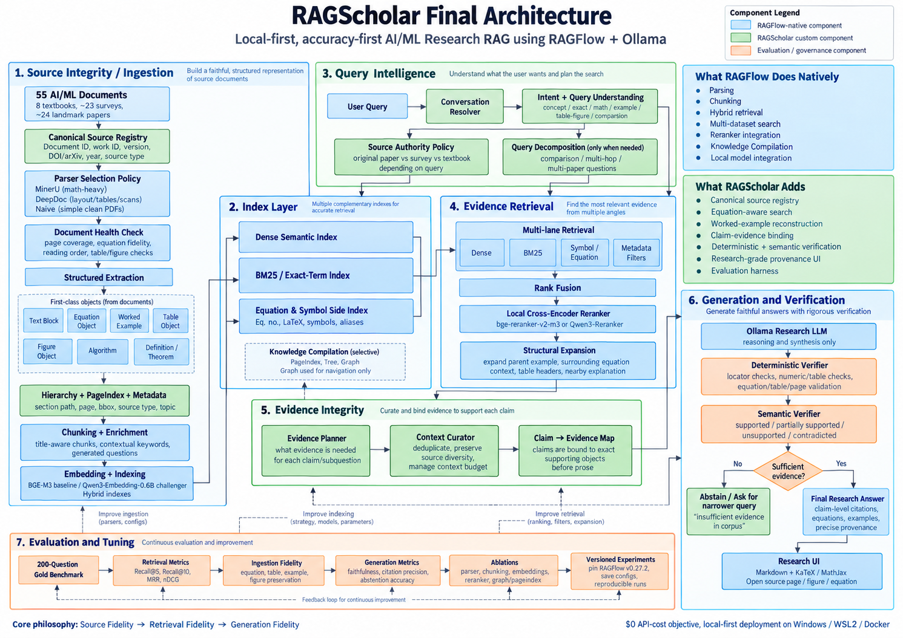

# RAGScholar

RAGScholar is a multimodal research-assistant pipeline for a curated machine-learning corpus. The notebooks audit the source PDFs, certify content readiness, and build text, mathematics, visual, and table retrieval artifacts. The standalone Flask application routes a question across the corpus, reranks evidence, and produces a source-grounded answer with citations.



> The PDF corpus, generated metadata, vector indexes, model artifacts, chat database, and recordings are intentionally excluded from Git. This repository contains the reproducible notebooks, application code, folder skeleton, and official source links needed to rebuild them locally.

## Repository layout

```text
ScholarGpt/
├── app/
│   ├── app.py
│   ├── rag_service.py
│   ├── static/
│   └── templates/
├── data/
│   ├── Landmark/       # 24 papers (PDFs ignored by Git)
│   ├── Survey/         # 23 papers (PDFs ignored by Git)
│   └── Textbooks/      # 6 books (PDFs ignored by Git)
├── notebooks/
│   ├── 01_Corpus_Audit_and_Registry.ipynb
│   ├── 02_Content_Readiness_and_Challenge_Set.ipynb
│   ├── 03_RAGScholar_Demo_Final_Rechecked.ipynb
│   └── RAGScholar_Full_Corpus.ipynb
├── .env.example
├── Architecture.png
├── requirements.txt
└── README.md
```

Local notebooks create two ignored directories:

- `metadata/` contains the corpus registry, audit reports, readiness profiles, and certification files.
- `artifacts/` contains parsed documents, retrieval records, BM25 indexes, FAISS indexes, visual crops, and manifests.

## Notebook workflow

Run notebooks from the project root and in this order:

1. `01_Corpus_Audit_and_Registry.ipynb` discovers the 53 PDFs, validates file health and identity, checks duplicates and provenance, and writes the certified corpus registry under `metadata/`.
2. `02_Content_Readiness_and_Challenge_Set.ipynb` consumes Notebook 01's certified registry, profiles every page, and writes content-readiness and challenge-set files under `metadata/notebook02/`.
3. `03_RAGScholar_Demo_Final_Rechecked.ipynb` is the single-book demonstration. It uses `data/Textbooks/UnderstandingDeepLearning_02_09_26_C.pdf` and writes a demonstration build under `artifacts/books/`.
4. `RAGScholar_Full_Corpus.ipynb` discovers the complete corpus and builds the production artifacts under `artifacts/ragscholar_full/`.
5. `app/app.py` loads the full-corpus artifacts and serves the standalone web application.

The demo and full-corpus notebooks contain old embedded `start_app(...)` launch cells at the end. Do not run those legacy cells; run the standalone application as described below. The full-corpus notebook also retains its local Ollama answer-layer experiment internally, but the standalone application uses Groq. Only the notebook filename was cleaned up; notebook content was not changed.

## Installation

Python 3.11 is recommended. A CUDA-capable GPU is strongly recommended for corpus construction and faster retrieval-model inference.

```bash
conda create -n ragscholar python=3.11 -y
conda activate ragscholar
pip install -r requirements.txt
```

MinerU and PyTorch may have platform-specific installation requirements. If either package cannot use your GPU, follow its official installation instructions for your CUDA version and then rerun the requirements command.

## Environment configuration

Copy the example file and add your Groq API key:

```bash
cp .env.example .env
```

On Windows PowerShell:

```powershell
Copy-Item .env.example .env
```

The application reads these settings:

```env
GROQ_API_KEY=your_groq_api_key
GROQ_MODEL=openai/gpt-oss-120b
GROQ_REASONING_EFFORT=medium
GROQ_MAX_OUTPUT_TOKENS=2400

RAGSCHOLAR_TOP_DOCS=5
RAGSCHOLAR_MAX_EVIDENCE=10
RAGSCHOLAR_EVIDENCE_CHARS=24000
RAGSCHOLAR_MAX_VISUAL_RESULTS=5

PORT=5000
```

Never commit the real `.env` file.

## Corpus setup

Download each document from its linked official author, publisher, proceedings, or arXiv page. Save it using the exact filename shown and place it in the matching folder. The links point to pages from which the paper or open-access book can be downloaded; source licensing still applies, so do not redistribute the PDFs through this repository.

The audited corpus contains exactly 53 files:

- `data/Landmark/`: 24 papers
- `data/Survey/`: 23 papers
- `data/Textbooks/`: 6 books

### Landmark papers

| Local filename | Document | Official source |
|---|---|---|
| `Landmark_1.pdf` | Attention Is All You Need | [arXiv:1706.03762](https://arxiv.org/abs/1706.03762) |
| `Landmark_2.pdf` | BERT: Pre-training of Deep Bidirectional Transformers for Language Understanding | [arXiv:1810.04805](https://arxiv.org/abs/1810.04805) |
| `Landmark_3.pdf` | Language Models are Few-Shot Learners | [arXiv:2005.14165](https://arxiv.org/abs/2005.14165) |
| `Landmark_4.pdf` | Retrieval-Augmented Generation for Knowledge-Intensive NLP Tasks | [arXiv:2005.11401](https://arxiv.org/abs/2005.11401) |
| `Landmark_5.pdf` | Dense Passage Retrieval for Open-Domain Question Answering | [arXiv:2004.04906](https://arxiv.org/abs/2004.04906) |
| `Landmark_6.pdf` | LoRA: Low-Rank Adaptation of Large Language Models | [arXiv:2106.09685](https://arxiv.org/abs/2106.09685) |
| `Landmark_7.pdf` | An Image Is Worth 16x16 Words: Transformers for Image Recognition at Scale | [arXiv:2010.11929](https://arxiv.org/abs/2010.11929) |
| `Landmark_8.pdf` | Learning Transferable Visual Models From Natural Language Supervision | [arXiv:2103.00020](https://arxiv.org/abs/2103.00020) |
| `Landmark_9.pdf` | ImageNet Classification with Deep Convolutional Neural Networks | [NeurIPS proceedings](https://proceedings.neurips.cc/paper/2012/hash/c399862d3b9d6b76c8436e924a68c45b-Abstract.html) |
| `Landmark_10.pdf` | Deep Residual Learning for Image Recognition | [arXiv:1512.03385](https://arxiv.org/abs/1512.03385) |
| `Landmark_11.pdf` | You Only Look Once: Unified, Real-Time Object Detection | [arXiv:1506.02640](https://arxiv.org/abs/1506.02640) |
| `Landmark_12.pdf` | Faster R-CNN: Towards Real-Time Object Detection with Region Proposal Networks | [arXiv:1506.01497](https://arxiv.org/abs/1506.01497) |
| `Landmark_13.pdf` | U-Net: Convolutional Networks for Biomedical Image Segmentation | [arXiv:1505.04597](https://arxiv.org/abs/1505.04597) |
| `Landmark_14.pdf` | Generative Adversarial Nets | [arXiv:1406.2661](https://arxiv.org/abs/1406.2661) |
| `Landmark_15.pdf` | Auto-Encoding Variational Bayes | [arXiv:1312.6114](https://arxiv.org/abs/1312.6114) |
| `Landmark_16.pdf` | Denoising Diffusion Probabilistic Models | [arXiv:2006.11239](https://arxiv.org/abs/2006.11239) |
| `Landmark_17.pdf` | Playing Atari with Deep Reinforcement Learning | [arXiv:1312.5602](https://arxiv.org/abs/1312.5602) |
| `Landmark_18.pdf` | Mastering Chess and Shogi by Self-Play with a General Reinforcement Learning Algorithm | [arXiv:1712.01815](https://arxiv.org/abs/1712.01815) |
| `Landmark_19.pdf` | Proximal Policy Optimization Algorithms | [arXiv:1707.06347](https://arxiv.org/abs/1707.06347) |
| `Landmark_20.pdf` | Continuous Control with Deep Reinforcement Learning | [arXiv:1509.02971](https://arxiv.org/abs/1509.02971) |
| `Landmark_21.pdf` | Semi-Supervised Classification with Graph Convolutional Networks | [arXiv:1609.02907](https://arxiv.org/abs/1609.02907) |
| `Landmark_22.pdf` | Adam: A Method for Stochastic Optimization | [arXiv:1412.6980](https://arxiv.org/abs/1412.6980) |
| `Landmark_23.pdf` | Batch Normalization: Accelerating Deep Network Training by Reducing Internal Covariate Shift | [arXiv:1502.03167](https://arxiv.org/abs/1502.03167) |
| `Landmark_24.pdf` | Efficient Estimation of Word Representations in Vector Space | [arXiv:1301.3781](https://arxiv.org/abs/1301.3781) |

### Survey papers

| Local filename | Document | Official source |
|---|---|---|
| `survey_1.pdf` | A Survey of Large Language Models | [arXiv:2303.18223](https://arxiv.org/abs/2303.18223) |
| `survey_1_14.pdf` | Self-supervised Learning: Generative or Contrastive | [arXiv:2006.08218](https://arxiv.org/abs/2006.08218) |
| `survey_2.pdf` | On the Opportunities and Risks of Foundation Models | [arXiv:2108.07258](https://arxiv.org/abs/2108.07258) |
| `survey_3.pdf` | Retrieval-Augmented Generation for Large Language Models: A Survey | [arXiv:2312.10997](https://arxiv.org/abs/2312.10997) |
| `survey_4.pdf` | A Survey on Evaluation of Large Language Models | [arXiv:2307.03109](https://arxiv.org/abs/2307.03109) |
| `survey_5.pdf` | A Survey on Hallucination in Large Language Models | [arXiv:2311.05232](https://arxiv.org/abs/2311.05232) |
| `survey_6.pdf` | The Rise and Potential of Large Language Model Based Agents: A Survey | [arXiv:2309.07864](https://arxiv.org/abs/2309.07864) |
| `survey_7.pdf` | A Survey on In-context Learning | [arXiv:2301.00234](https://arxiv.org/abs/2301.00234) |
| `survey_8.pdf` | Parameter-Efficient Fine-Tuning for Large Models: A Comprehensive Survey | [arXiv:2403.14608](https://arxiv.org/abs/2403.14608) |
| `survey_9.pdf` | A Survey on Model Compression for Large Language Models | [arXiv:2308.07633](https://arxiv.org/abs/2308.07633) |
| `survey_10.pdf` | A Survey on Multimodal Large Language Models | [arXiv:2306.13549](https://arxiv.org/abs/2306.13549) |
| `survey_11.pdf` | A Survey of Transformers | [arXiv:2106.04554](https://arxiv.org/abs/2106.04554) |
| `survey_12.pdf` | Transformers in Vision: A Survey | [arXiv:2101.01169](https://arxiv.org/abs/2101.01169) |
| `survey_13.pdf` | Diffusion Models: A Comprehensive Survey of Methods and Applications | [arXiv:2209.00796](https://arxiv.org/abs/2209.00796) |
| `survey_15.pdf` | Graph Neural Networks: A Review of Methods and Applications | [arXiv:1812.08434](https://arxiv.org/abs/1812.08434) |
| `survey_16.pdf` | A Comprehensive Survey on Transfer Learning | [arXiv:1911.02685](https://arxiv.org/abs/1911.02685) |
| `survey_17.pdf` | AutoML: A Survey of the State-of-the-Art | [arXiv:1908.00709](https://arxiv.org/abs/1908.00709) |
| `survey_18.pdf` | A Continual Learning Survey: Defying Forgetting in Classification Tasks | [arXiv:1909.08383](https://arxiv.org/abs/1909.08383) |
| `survey_19.pdf` | Deep Learning for Generic Object Detection: A Survey | [arXiv:1809.02165](https://arxiv.org/abs/1809.02165) |
| `survey_20.pdf` | Deep Learning for Anomaly Detection: A Review | [arXiv:2007.02500](https://arxiv.org/abs/2007.02500) |
| `survey_21.pdf` | Explainable Artificial Intelligence (XAI): Concepts, Taxonomies, Opportunities and Challenges toward Responsible AI | [arXiv:1910.10045](https://arxiv.org/abs/1910.10045) |
| `survey_22.pdf` | Deep Reinforcement Learning: A Brief Survey | [arXiv:1708.05866](https://arxiv.org/abs/1708.05866) |
| `survey_23.pdf` | Geometric Deep Learning: Grids, Groups, Graphs, Geodesics, and Gauges | [arXiv:2104.13478](https://arxiv.org/abs/2104.13478) |

The numbering intentionally follows the audited local corpus: there is no `survey_14.pdf`, while `survey_1_14.pdf` is a distinct file.

### Textbooks

| Local filename | Book | Official/open-access source |
|---|---|---|
| `book1.pdf` | Probabilistic Machine Learning: An Introduction | [Author-maintained book page](https://probml.github.io/book1) |
| `book2.pdf` | Probabilistic Machine Learning: Advanced Topics | [Author-maintained book page](https://probml.github.io/book2) |
| `d2l-en.pdf` | Dive into Deep Learning | [Official PDF](https://d2l.ai/d2l-en.pdf) |
| `ESLII_print12_toc.pdf` | The Elements of Statistical Learning: Data Mining, Inference, and Prediction | [Official author page and download](https://hastie.su.domains/ElemStatLearn/) |
| `mml-book.pdf` | Mathematics for Machine Learning | [Official PDF](https://mml-book.github.io/book/mml-book.pdf) |
| `UnderstandingDeepLearning_02_09_26_C.pdf` | Understanding Deep Learning | [Official author site](https://udlbook.github.io/udlbook/) / [MIT Press open-access page](https://mitpress.mit.edu/9780262377102/understanding-deep-learning/) |

After downloading, the local structure should be:

```text
data/
├── Landmark/
│   ├── Landmark_1.pdf
│   └── ...
├── Survey/
│   ├── survey_1.pdf
│   └── ...
└── Textbooks/
    ├── book1.pdf
    ├── book2.pdf
    ├── d2l-en.pdf
    ├── ESLII_print12_toc.pdf
    ├── mml-book.pdf
    └── UnderstandingDeepLearning_02_09_26_C.pdf
```

The `.gitkeep` files are repository placeholders, not corpus documents. Notebook 01's early inventory section may show a non-blocking `REVIEW REQUIRED` for these hidden non-PDF files. It also retains an earlier 8-textbook/55-document expectation in its initial count display. The notebook's final independent certification is the authoritative gate and validates the current audited target of 6 textbooks and 53 total documents.

## Build the corpus

Start Jupyter from the project root:

```bash
jupyter lab
```

Run Notebooks 01 and 02 first. Notebook 03 is useful for validating the retrieval pipeline against one textbook. For the production corpus, open `notebooks/RAGScholar_Full_Corpus.ipynb` and run Sections 0-9 once.

Section 10 intentionally builds the corpus in restart-safe batches: one pending textbook per execution, or up to 12 other documents within a 600-page budget. Re-run the Section 10 cell until it reports `Total completed: 53/53`, and confirm that no build failures remain. Then run Sections 11-18 to rebuild the corpus router and final manifest from all completed documents.

The production notebook writes:

```text
artifacts/
└── ragscholar_full/
    ├── corpus/
    │   ├── documents.jsonl
    │   ├── documents.faiss
    │   └── manifest.json
    └── documents/
        └── doc_*/
            ├── manifest.json
            ├── canonical/
            ├── text/
            ├── math/
            ├── visual/
            └── table/
```

Corpus construction is compute-, storage-, and network-intensive. The first run also downloads the configured embedding, reranker, parser, OCR, and vision models.

## Run the standalone web application

The production app requires a completed `artifacts/ragscholar_full/` build.

```bash
conda activate ragscholar
python app/app.py
```

Open <http://127.0.0.1:5000>. The local chat database is created automatically under `app/` and is ignored by Git.

The application currently uses:

- Qwen3 Embedding for dense retrieval
- BM25 for lexical retrieval
- Qwen3 Reranker for evidence reranking
- SigLIP2 for visual retrieval
- Groq's OpenAI-compatible API for grounded answer generation

## GitHub contents policy

Included in Git:

- application source and frontend assets
- the four active notebooks
- empty corpus folder structure
- architecture image, README, requirements, environment template, and license

Excluded from Git:

- `.env` and local credentials
- all corpus PDFs
- `metadata/` and `artifacts/`
- database/cache files
- `Video/`
- `RAGScholar_Main_Frozen_MathRAG_V1.ipynb`

Ignoring these paths does not delete local files. It only prevents them from being added to future commits.
